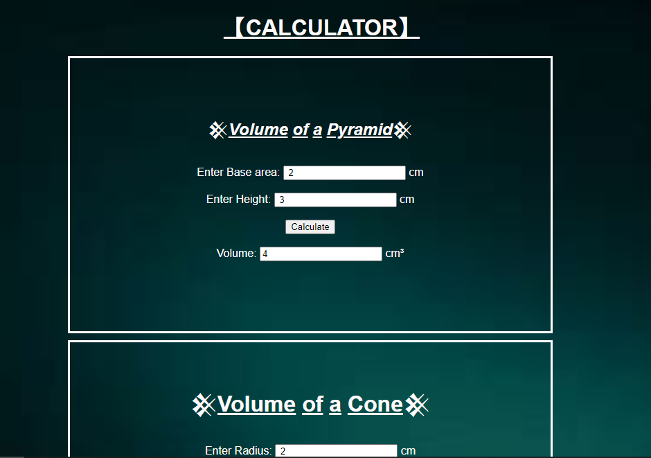
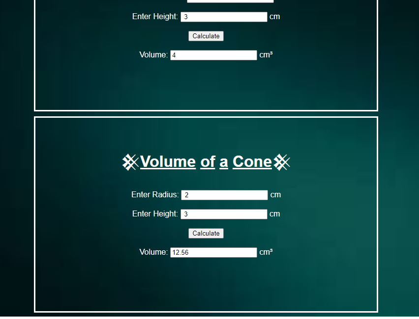

# Web Page for Mathematical Calculations

## AIM:

To design a static website with validation to perform mathematical calculations in client side.

## DESIGN STEPS:

### Step 1:

Requirement collection.

### Step 2:

Creating the layout using HTML and CSS.

### Step 3:

Write javascript to perform the calculations.

### Step 4:

Include regularexpression based input validation.

### Step 5:

Validate the layout in various browsers.

### Step 6:

Validate the HTML code.

### Step 6:

Publish the website in the given URL.

## PROGRAM :
~~~
<!DOCTYPE html>
<html lang="en">
<head>
    <meta charset="UTF-8">
    <meta http-equiv="X-UA-Compatible" content="IE=edge">
    <meta name="viewport" content="width=device-width, initial-scale=1.0">
    <title>Javascript</title>
    
</head>
<body>
    <h1><u>【CALCULATOR】</u></h1>
    

        

            <h2>𒆜<u>Volume</u> <u>of</u> <u>a</u> <u>Pyramid</u>𒆜</h2>
            <form>
                
 
                    <label for="aedit">Enter Base area:</label>
                    <input type="text" id="aedit" value=" "/><label> cm</label>
                

                

                 
                    <label for="bedit">Enter Height:</label>
                    <input type="text" id="bedit" value=" "/><label> cm</label>
                

                

                 
                    <input type="button" value="Calculate" id="addbutton"/>
                

                

                 
                    <label for="cedit">Volume:</label>
                    <input type="text" id="cedit" readonly value=" "/><label> cm³</label>
                

            </form>
    

    

    

    

        <h1>𒆜<u>Volume</u> <u>of</u> <u>a</u> <u>Cone</u>𒆜</h1>
        <form>
            
 
                <label for="dedit">Enter Radius:</label>
                <input type="text" id="dedit" value=" "/><label> cm</label>
            

            

             
                <label for="eedit">Enter Height:</label>
                <input type="text" id="eedit" value=" "/><label> cm</label>
            

            

             
                <input type="button" value="Calculate" id="button"/>
            

            

             
                <label for="fedit">Volume:</label>
                <input type="text" id="fedit" readonly value=" "/><label> cm³</label>
            

        </form>

    

</body>
</html>
~~~
## OUTPUT:

## Result:

Thus a website is designed to perform mathematical calculations in the client side.
